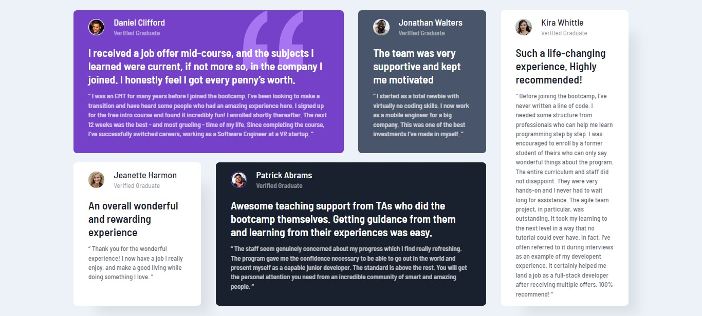

# Frontend Mentor - Testimonials grid section solution

This is a solution to the [Testimonials grid section challenge on Frontend Mentor](https://www.frontendmentor.io/challenges/testimonials-grid-section-Nnw6J7Un7). Frontend Mentor challenges help you improve your coding skills by building realistic projects. 

## Table of contents

- [Overview](#overview)
  - [The challenge](#the-challenge)
  - [Screenshot](#screenshot)
  - [Links](#links)
- [My process](#my-process)
  - [Built with](#built-with)
  - [Author](#author)

## Overview

### The challenge

Users should be able to:

- View the optimal layout for the site depending on their device's screen size

### Screenshot

Desktop view             |  Mobile view
:-------------------------:|:-------------------------:
  |  

### Links

- Solution URL: [Frontend mentor solution link](https://www.frontendmentor.io/solutions/testimonials-grid-section-made-with-using-html-and-css-MUv8IjZXCP)
- Live Site URL: [Deployed project link](https://testimonals-section.netlify.app/)

## My process

### Built with

- Semantic HTML5 markup
- CSS custom properties
- Flexbox
- CSS Grid

## Author

- Frontend Mentor - [@Shard-Codes](https://twitter.com/Shard_Codes)
- Twitter - [@Shard_Codes](https://www.twitter.com/yourusername)
